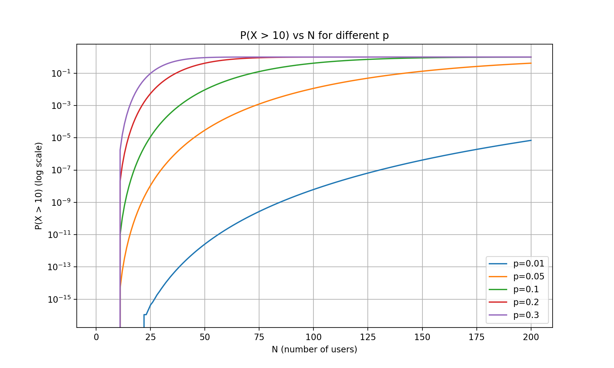
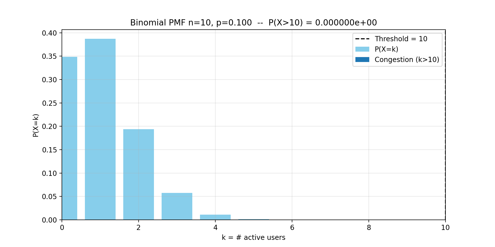
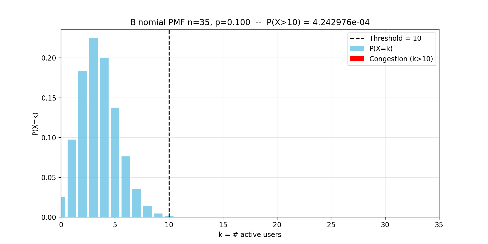
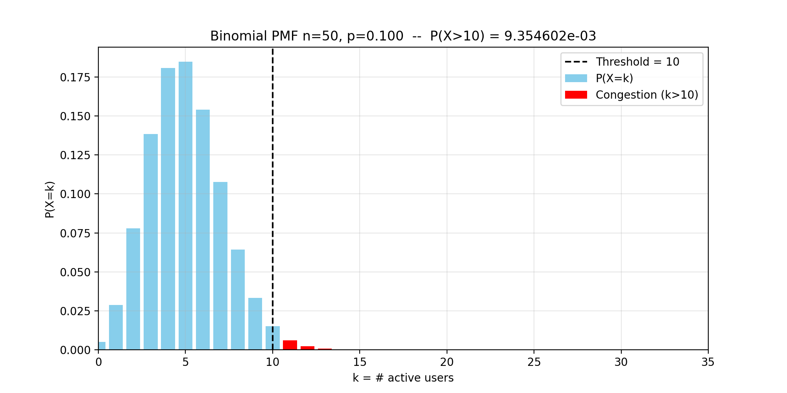
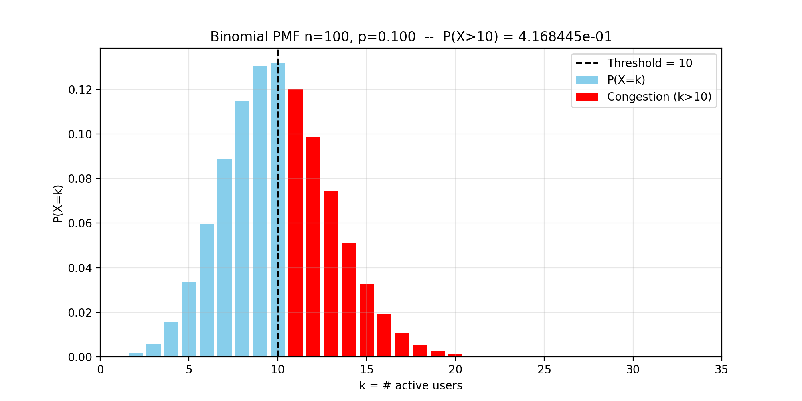
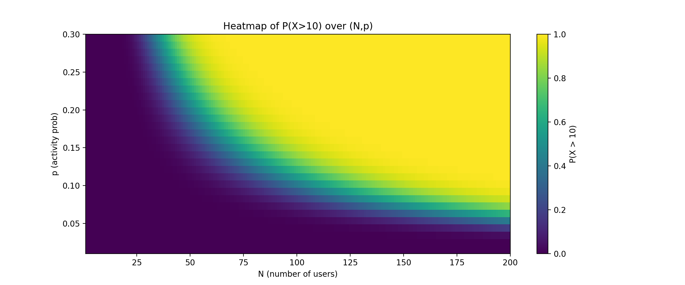

# Packet vs Circuit Switching Analysis

---

## Përshkrimi i Projektit

Ky projekt trajton krahasimin mes dy paradigmave kryesore të rrjetëzimit – **packet-switching** (ku të dhënat ndahen në paketa të pavarura dhe transmetohen në mënyrë asinkrone) dhe **circuit-switching** (ku krijohet një qark i dedikuar për çdo sesion komunikimi).  

Projektimi përdor **shpërndarjen binomiale** për të simuluar aktivitetin e rastësishëm të përdoruesve dhe përllogarit probabilitetin e mbingarkesës **P(X > k)**.

---

## Objektivat e Projektit

**Qëllimi Kryesor:**  
- Demonstrohet se packet-switching ofron efikasitet më të lartë se circuit-switching në skenarë me aktivitet të ulët (p.sh., p=0.1), por rrezikon mbingarkesë kur numri i përdoruesve (N) rritet.

**Qëllime Sekondare:**  
- Analizë e probabiliteteve të bishtit për N=1..200 dhe vlera të ndryshme të probabilitetit p.  
- Krahasim mes rezultateve teorike, aproximimit normal dhe simulimeve Monte Carlo.  
- Gjenerimi i grafikëve dhe raporteve për interpretim akademik.

---

## Struktura e Projektit

- **Main script:** `packet_vs_circuit_improved.py`  
- **Outputs dhe Figurat:**  

- **Tail Probability vs N**
- **File:** `outputs/tail_vs_n_log.png`  
- ## Figura: $\mathbf{P(X > 10) \text{ vs } N \text{ for different } p}$

Kjo figurë tregon rritjen e probabilitetit të mbingarkesës $P(X>10)$ ndërsa rritet numri i përdoruesve ($N$) për pesë vlera të ndryshme të probabilitetit të aktivitetit ($p$).

---

## 1. Kuptimi i Boshteve

| Element | Përshkrimi | Kuptimi Inxhinierik |
| :--- | :--- | :--- |
| **Boshti X ($N$)** | Numri i përdoruesve totalë | Tregon sa përdorues përpiqen të jenë aktivë në rrjet |
| **Boshti Y (Log Scale)** | Tail Probability $P(X>10)$ | Mat rrezikun e dështimit të QoS |
| **$N$ 1–10** | $\mathbf{P(X>10)=0}$ | Përdoruesit aktivë nuk arrijnë pragun, sistemi i sigurt |

---

## 2. Analiza e Kurbave

* **Rrezik i Lartë ($p=0.2, 0.3$)**: Kurbat ngjyrë vjollcë/kuqe rriten shumë shpejt; sistemi bëhet i mbingarkuar me përdorues të pakët.  
* **Rasti Tipik ($p=0.1$)**: Kurba portokalli rritet gradualisht; P(X>10) kalon $10^{-3}$ rreth $N \approx 55$. Për $N=35$, P≈0.0004 — PS fiton 3.5 herë kapacitet më shumë se Circuit Switching.  
* **Rrezik Minimal ($p=0.01$)**: Vija blu ngadalë; për $N=200$, P≈10⁻⁵. PS mund të mbajë shumë përdorues aktivë pa rrezik.

---

## 3. Përfundimi

1. **Rritja Eksponenciale e Rrezikut:** Çdo përdorues i ri shton një rrezik më të madh pas arritjes së mesatares $N \cdot p \approx 5$.  
2. **Varësia nga Trafiku:** Suksesi i PS varet nga natyra e trafikut; përdoruesit duhet të qëndrojnë në zonën “blu/vjollcë” për të siguruar QoS.  

> Ky grafik shërben si udhëzues për **planifikimin e kapacitetit**, duke treguar rrezikun për çdo $N$ dhe $p$.

 
- **Figura:**

### PMF për N të ndryshme
- **N=10:** `outputs/pmf_n_10.png` — PMF e N=10, **P(X>10)=0**, skenar ideal për packet-switching  

- **N=35:** `outputs/pmf_n_35.png` — Bishti i kuq minimal, **P(X>10)=4.24e-4**  

- **N=50:** `outputs/pmf_n_50.png` — P(X>10)=9.36e-3, rreziku rritet lehtësisht  

- **N=100:** `outputs/pmf_n_100.png` — P(X>10)=0.417, rrezik i konsiderueshëm për packet-switching  

### Heatmap
- **File:** `outputs/heatmap.png` — Heatmap 2D P(X>10) mbi N=1..200 dhe p=0.01..0.3  
- **Interpretimi:** Zona blu: probabilitet i ulët, zona e verdhë/purpuri: probabilitet i lartë. Tregon kufirin e sigurt për dimensionimin e rrjetit.  

---

## Tabela verfikuese

- Krahasim teorik vs Monte Carlo vs normal approximation për N=[35,50,100], p=0.1:

| N   | Theoretical | Monte Carlo | Normal Approx |
|-----|------------|------------|---------------|
| 35  | 0.000424   | 0.000425   | 0.0000405     |
| 50  | 0.009355   | 0.009585   | 0.004761      |
| 100 | 0.416844   | 0.415705   | 0.433816      |

---

## Metodologjia

**Veglat e përdorura:**  
- Python 3.12.3  
- NumPy: Llogaritje numerike dhe gjenerim numrash të rastësishëm  
- Pandas: Menaxhim i të dhënave dhe eksport në CSV  
- SciPy: Shpërndarje binomiale dhe normale  
- Matplotlib: Vizualizim, ruajtje PNG dhe PDF  
- OS & Time: Menaxhim direktorish dhe matja e kohës së ekzekutimit  

**Hapat e Implementimit:**  
1. Caktimi i parametrave kryesorë: `LINK_CAPACITY_MBPS=1000`, `USER_RATE_MBPS=100`, `THRESHOLD_USERS=10`, `DEFAULT_P=0.1`  
2. Funksionet utility: `circuit_switching_capacity`, `binomial_pmf`, `binomial_tail_prob`, `normal_approx_tail`, `monte_carlo_tail`  
3. Analizat e larta: `compute_tail_for_range`, `varied_p_analysis`  
4. Gjenerimi i grafikëve: `plot_tail_vs_n`, `plot_pmf_for_n`, `plot_heatmap`  
5. Verifikimi: `verify_theoretical_vs_montecarlo`  
6. Ruajtja e rezultateve: CSV, PNG, PDF  

---

## Përfundimet

- **Packet-switching** është superior për rrjete me aktivitet të ulët (p<0.1), duke lejuar më shumë përdorues se circuit-switching me probabilitet mbingarkese <1%.  
- Për **p>0.2** ose N të mëdha, rreziku rritet ndjeshëm.  
- Verifikimi tregon se modeli binomial është i besueshëm (devijim <1% nga Monte Carlo).  
- Analizat vizuale (PMF, tail vs N, heatmap) ilustrojnë kufijtë dhe avantazhet e secilës paradigmë.

