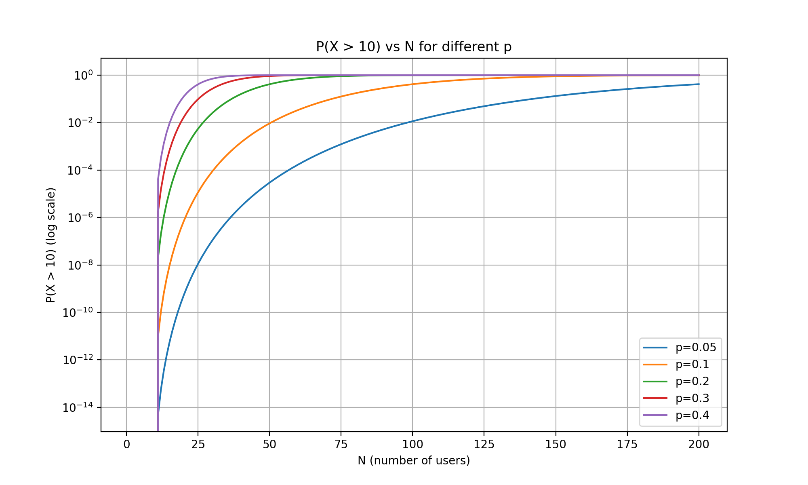

# Packet vs Circuit Switching Analysis

---

## Përshkrimi i Projektit

Ky projekt akademik trajton krahasimin mes dy paradigmave kryesore të rrjetëzimit – **packet-switching** (ku të dhënat ndahen në paketa të pavarura dhe transmetohen në mënyrë asinkrone) dhe **circuit-switching** (ku krijohet një qark i dedikuar për çdo sesion komunikimi).  

Projektimi përdor **shpërndarjen binomiale** për të simuluar aktivitetin e rastësishëm të përdoruesve dhe përllogarit probabilitetin e mbingarkesës **P(X > k)**.

---

## Objektivat e Projektit

**Qëllimi Kryesor:**  
- Demonstrohet se packet-switching ofron efikasitet më të lartë se circuit-switching në skenarë me aktivitet të ulët (p.sh., p=0.1), por rrezikon mbingarkesë kur numri i përdoruesve (N) rritet.

**Qëllime Sekondare:**  
- Analizë e probabiliteteve të bishtit për N=1..200 dhe vlera të ndryshme të probabilitetit p.  
- Krahasim mes rezultateve teorike, aproximimit normal dhe simulimeve Monte Carlo.  
- Gjenerimi i grafikëve dhe raporteve për interpretim akademik.

---

## Struktura e Projektit

- **Main script:** `packet_vs_circuit_improved.py`  
- **Outputs dhe Figurët:**  

### Tail Probability vs N
- **File:** `outputs/tail_vs_n_log.png`  
- **Përshkrimi:** Linja të **P(X>10)** për N=1..200 dhe p=[0.01,0.05,0.1,0.2,0.3]. Shkalla logaritmike y thekson probabilitetet e vogla.  
- **Figura:**

### PMF për N të ndryshme
- **N=10:** `outputs/pmf_n_10.png` — PMF e N=10, **P(X>10)=0**, skenar ideal për packet-switching  

- **N=35:** `outputs/pmf_n_35.png` — Bishti i kuq minimal, **P(X>10)=4.24e-4**  

- **N=50:** `outputs/pmf_n_50.png` — P(X>10)=9.36e-3, rreziku rritet lehtësisht  

- **N=100:** `outputs/pmf_n_100.png` — P(X>10)=0.417, rrezik i konsiderueshëm për packet-switching  

### Heatmap
- **File:** `outputs/heatmap.png` — Heatmap 2D P(X>10) mbi N=1..200 dhe p=0.01..0.3  
- **Interpretimi:** Zona blu: probabilitet i ulët, zona e verdhë/purpuri: probabilitet i lartë. Tregon kufirin e sigurt për dimensionimin e rrjetit.  

---

## Verification Table

- Krahasim teorik vs Monte Carlo vs normal approximation për N=[35,50,100], p=0.1:

| N   | Theoretical | Monte Carlo | Normal Approx |
|-----|------------|------------|---------------|
| 35  | 0.000424   | 0.000425   | 0.0000405     |
| 50  | 0.009355   | 0.009585   | 0.004761      |
| 100 | 0.416844   | 0.415705   | 0.433816      |

---

## Metodologjia

**Veglat e përdorura:**  
- Python 3.12.3  
- NumPy: Llogaritje numerike dhe gjenerim numrash të rastësishëm  
- Pandas: Menaxhim i të dhënave dhe eksport në CSV  
- SciPy: Shpërndarje binomiale dhe normale  
- Matplotlib: Vizualizim, ruajtje PNG dhe PDF  
- OS & Time: Menaxhim direktorish dhe matja e kohës së ekzekutimit  

**Hapat e Implementimit:**  
1. Caktimi i parametrave kryesorë: `LINK_CAPACITY_MBPS=1000`, `USER_RATE_MBPS=100`, `THRESHOLD_USERS=10`, `DEFAULT_P=0.1`  
2. Funksionet utility: `circuit_switching_capacity`, `binomial_pmf`, `binomial_tail_prob`, `normal_approx_tail`, `monte_carlo_tail`  
3. Analizat e larta: `compute_tail_for_range`, `varied_p_analysis`  
4. Gjenerimi i grafikëve: `plot_tail_vs_n`, `plot_pmf_for_n`, `plot_heatmap`  
5. Verifikimi: `verify_theoretical_vs_montecarlo`  
6. Ruajtja e rezultateve: CSV, PNG, PDF  

---

## Përfundimet

- **Packet-switching** është superior për rrjete me aktivitet të ulët (p<0.1), duke lejuar më shumë përdorues se circuit-switching me probabilitet mbingarkese <1%.  
- Për **p>0.2** ose N të mëdha, rreziku rritet ndjeshëm.  
- Verifikimi tregon se modeli binomial është i besueshëm (devijim <1% nga Monte Carlo).  
- Analizat vizuale (PMF, tail vs N, heatmap) ilustrojnë kufijtë dhe avantazhet e secilës paradigmë.

